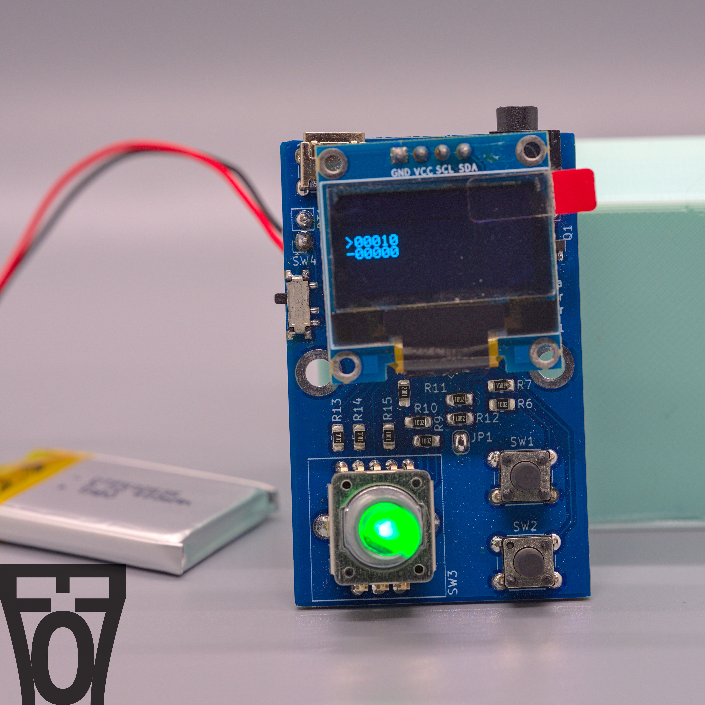

# Camera Remote Shutter Project
#### Rev 1.0-alpha

This is an open-source camera remote shutter.



## Enclosure
There is a work-in-progress enclosure for the PCB under the [CAD](CAD) folder. The enclosure is made with FreeCAD 0.20.

## Firmware
The firmware for this project is in the `AVR` folder. To build the code, simply run

```
make
```

This will generate a binary to upload to the MCU. To program the board, you can connect an Arduino Uno acting as an ISP device to the 3x2 connector on the board (J2). Then you can use the following make argument to upload with AVRDude. The port is asssumed to be `/dev/ttyUSB0`, so if that is different you can change the makefile.

```
make program
```

## KiCAD 3D Models
The 3D models for some components in the directory `PCB/3d_model/` are not included due to licensing reasons. You can grab the step files yourself and put it in that directory from the manufacturer. The models are
- 12CE3H26F12T24.stp
- CUI_DEVICES_SJ-2509N.step
